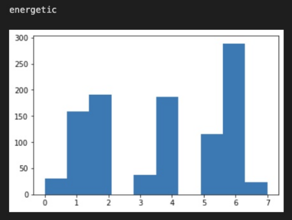
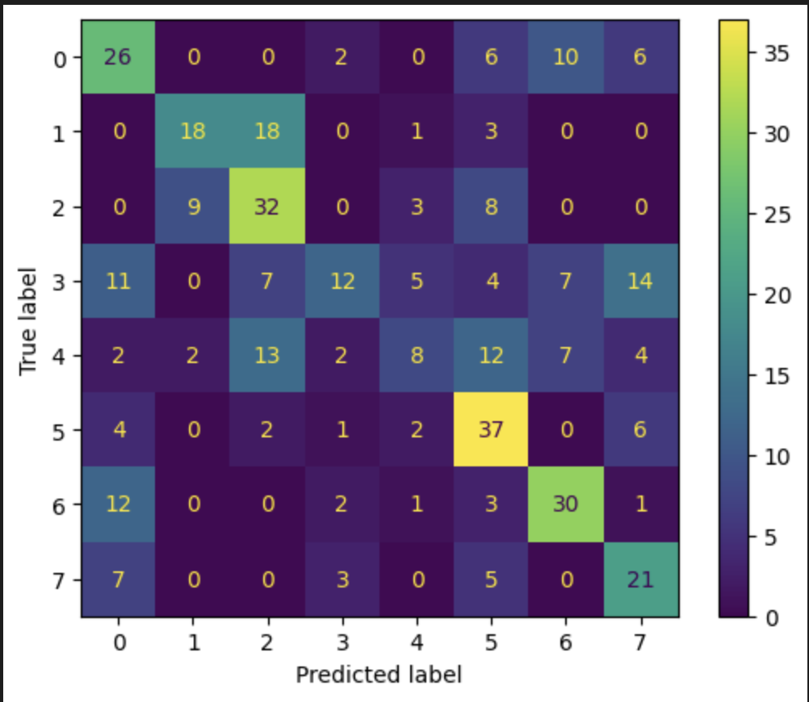

# CS 4641 Group 41 Project - Magnificent Music 

## Project Final Report

### Introduction

Music is used worldwide as a tool through which people can express their emotions. The wide variety of songs available through platforms such as Spotify and Apple Music allows for endless possibilities for songs corresponding to specific emotions. Research has been done to map certain songs to emotions using support vector machines (SVMs) on waveforms [1], semantic analysis on the lyrics of songs [2], and other machine learning tools. Unfortunately, with current studies on music emotion detection, the ranges of emotions and means of analysis tend to be narrow or focused on one type of music (i.e, Carnatic music [1]). Therefore, our project, Magnificent Music, uses an expansive dataset and a holistic machine learning approach to ensure that we are able to detect emotion accurately in a wide variety of music.

#### Problem Definition

In order for users to get the most accurate and extensive data on the emotions displayed in their music, we analyse an inclusive dataset with features such as lyrics, duration, and genre to allow for better playlist recommendations and better algorithms. We will also try to analyse what qualities of music evoke certain emotions.

#### Data Collection
Spotify contains a plethora of songs that come with various metrics which measure a song's danceability, valence, tempo, and more (11 features). We queried the Spotify api to get a list of songs that are in playlists for the 8 emotions. We then add all these songs to our dataset and label them with their respective emotion. At the end we had around 8k unique songs. 

Visit spotify's website to see more about the features that were used in this project: [Features Used](https://developer.spotify.com/discover/). Here's the link to the [Spotify dataset](https://drive.google.com/file/d/11RC-xWlOgw4Fkd0eN6Uttr7M6BkMyXiE/view?usp=sharing) (~8000 datapoints)

#### Methods

We will use a mixed set of supervised and unsupervised learning models to be able to classify our music into emotions. Firstly, we will cluster the music embeddings using DBSCAN, hierarchical clustering, and k-means to identify patterns that could help in our classification. To deal with the "curse of dimensionality", we will perform principle component analysis (PCA) to help clustering algorithms and visualize the results. We will then classify the songs based on certain tags present in the dataset. Utilizing data such as pitch and rhythmic contents with SVMs has been proven to work in the past for emotion detection within music [3]. 

#### Analysis

The primary method by which we will be evaluating our model is through test set accuracy. We will split up our dataset at around a 50-50 ratio, with one part belonging to the training set, and another part belonging to the test set. Once our model is finished training, we will operate it on the test set to receive our baseline accuracy.

Given the internal measures (silhouette coefficient, Davies-Bouldin Index), we will measure how well the clustering algorithm categorizes our data. It will work with the same number of clusters as the ground truth partitions. If the clustering algorithm properly separates the data, we could see if it categorized the music with similar emotions or if it identified previously unseen similarities.

For the external measures, we can see how well the algorithm classified the music into the emotions we intended. Similarly, we will also use external measures (accuracy, precision, and recall) to measure classification performance. If our classification algorithm performs well on our dataset, we can feasibly extend this to data not seen in training to possibly categorize and recommend music to certain users based on the identified emotion.

<!-- ### Video Presentation (Project Proposal)


[Video Presentation Link](https://youtu.be/xQs_r0_CtPA)
 -->
 
---
### Data Munging

We normalized the data so that we could get a faster convergence and we also cleaned the data by removing the NANs and null values. There are 11 features we can use for general analysis: ['danceability', 'energy', 'key', 'loudness', 'mode', 'speechiness', 'acousticness', 'instrumentalness', 'liveness', 'valence', 'tempo'].

Originally, we had 8 emotions ({'anger': 0, 'calming': 1, 'relaxing': 2, 'energetic': 3, 'dark': 4, 'sad': 5, 'aggressive': 6, 'happy': 7}) that we would map songs to, but we reduced our emotion set to 4 ({'calming':1, 'energetic':2,'anger':3,'sad':4}) upon realizing that there were some similar emotions that led to overlap within some songs. After analyzing clustering algorithm outputs, we were able to merge emotions like calming and relaxing together.

We ran both principle component analysis (PCA) and forward selection to determine which of our features are the most important. Furthermore, our PCA findings were used for logistic regression (down below) as well as to project the data points onto a 2d plane for visualization.

Shown here are the top **8** most important features according to forward selection in order of most important to least important.

['valence', 'instrumentalness', 'danceability', 'speechiness', 'loudness', 'energy', 'liveness', 'key']

---
### Results and Analysis

#### PCA Visualizations (old dataset with 8 emotions)


<p align = "center">Complete dataset.</p>


<p align = "center">PCA Visualization of the "anger" and "calming" tags with the 2 most important features.</p>


<p align = "center">PCA Visualization of the "relaxing" and "calming" tags with the 2 most important features.</p>


#### PCA Visualization (modified/current dataset with 4 emotions)

<p align = "center"></p>

<p align = "center">Complete dataset.</p>


<p align = "center"><b>These plots compare the differences between relaxing and another label, and show how different the dataset is.</b></p>

<p align = "center"></p>

<p align = "center">PCA Visualization of the "aggressive" and "relaxing" tags with the 2 most important features.</p>


<p align = "center"></p>

<p align = "center">PCA Visualization of the "happy" and "relaxing" tags with the 2 most important features.</p>


<p align = "center"></p>

<p align = "center">PCA Visualization of the "sad" and "relaxing" tags with the 2 most important features.</p>

#### K-Means

Below are histograms representing the K-Means results. We ran K-Means on the dataset with 8 clusters and then looked at each tag and drew a histogram on how that tag was distributed by the K-Means algorithm. We see similarities between some tags, such as "calming" and "relaxing", and how they are distributed by K-Means. 

This is our K-means results for the old dataset with 8 emotions.

| | | | |
|:-------------------------:|:-------------------------:|:-------------------------:|:-------------------------:|
||  ||   |  
|||   |  |


<p align = "center">We noticed a lot of similarities in clusterings such as calming/relaxing, dark/aggressive, and more, so this gave us further reason to reduce the emotions from 8 to 4. Each of the plots represents the number of elements belonging to that tag that belong to each of the Kmeans clusters. For example, for the tag calming, about 300 of the songs belonging to that tag were in cluster 7 of the Kmeans algorithm.</p>

| | | | |
|:-------------------------:|:-------------------------:|:-------------------------:|:-------------------------:|
||  ||   |  

This is our K-means results for the new dataset with 4 emotions. This did not give us a substantial increase in accuracy but the model was able to differentiate between calming and non-calming songs.

#### GMM
<p align = "center"></p>

We ran GMM after this to see if it could better cluster the dataset but it could only differentiate between calming and non-calming songs. 
This leads us to believe that calming songs are very different in the features we chose on a very basic level (such that they can be separated easily using a simple distance function).


#### Logistic Regression
Our process for logistic regression was as follows:

1. We normalized the data
2. We ran PCA on the data from 2 components all the way up to 11 components (total number of features we have)
3. For each of the PCA trials we did above, we ran multiclass logistic regression on each of them to see if the absence of features would greatly affect our accuracy 

#### Analysis of Best Logistic Regression

Our original logistic regression model had a validation accuracy of 47.30%. This is a fairly low accuracy and can be caused by a number of issues we outlined above. We believe that the primary cause of this lower accuracy is the similarity of the features. The metrics for each of the features and the confusion matrix for our logistic regression are shown below. It is apparent that pairs tags with similar feature attributes are the most often misclassified, and leads us to a similar conclusion as above; namely, that these tag pairs should be merged in order to build a more definitive distinction between our classes.


<p align = "center"></p>

<p align = "center"></p>

These results are post-dataset modification (4 emotions). As we can see, we have a higher accuracy post emotion merge (66%).

<p align = "center"></p>

Above is a confusion matrix which maps frequencies of true labels mapping to predicted labels. We look at the diagonal elements from the top left to the bottom right, and these represent accurate predictions. Label 1 is predicted correctly 82 times, label 2 is predicted correctly 56 times, label 3 is predicted correctly 96 times, and label 4 is predicted correctly 22 times. There are some noticeable incorrect predictions. For instance, label 3 was incorrectly predicted as label 1 24 times, and label 2 was incorrectly predicted as label 3 34 times. However, for the most part, our confusion matrix shows that the model does a good job of predicting the true labels.

<p align = "center"></p>

As we can see, calming/energetic/anger all have relatively high precision and recall scores which shows on average the model makes correct predictions and is also output-sensitive. However, sad has low precision and recall scores and we believe this is due to overlapping songs.


#### Neural Network

In addition to the numerous unsupervised models we used, we decided to also test our data on a densely connected neural network. The high level architecture of the network is shown below.

As you can see, the network is not very dense. This is primarily due to the computational constraints and the nature of our data itself. Since we were only utilizing 11 features for each datapoint, there was a high risk of overfitting and vanishing gradients during our training process.

To combat these issues, we included batch normalization and dropout layers into our network. These served to normalize our features as they propogate forward through our network and also ensure that we don’t calculate overly large weights, which are a clear sign of overfitting.

```
=================================================================
=================================================================
Layer (type:depth-idx)                   Param #
=================================================================
├─Sequential: 1-1                        --
|    └─Linear: 2-1                       6,144
|    └─BatchNorm1d: 2-2                  1,024
|    └─Dropout: 2-3                      --
|    └─Linear: 2-4                       131,328
|    └─BatchNorm1d: 2-5                  512
|    └─Dropout: 2-6                      --
|    └─Linear: 2-7                       16,448
|    └─BatchNorm1d: 2-8                  128
|    └─Dropout: 2-9                      --
|    └─Linear: 2-10                      260
=================================================================
Total params: 155,844
Trainable params: 155,844
Non-trainable params: 0
=================================================================
```

##### Hyperparameters

Another expirimental portion of our neural network training process was our set of hyperparameters. We approached these values with a trial-and-error approach since our architecture was unique to our specific problem. Most of our hyperparameters remained the same throughout the process, but one that drastically changed was our number of epochs and our batch size.
We noticed that there was a larger impact on our accuracy in decreasing our batch size and increasing our epochs; thus, our general trend was to follow this path. Once we reached a point of diminishing returns, we were able to reach our maximum accuracy and minimum loss on our validation set.

```
Learning Rate: 0.001
Learning Rate Exponential Decay: 0.9
Momentum: 0.9
Weight Decay: 0.0001
Epochs: 150
Batch Size: 5
```
Below, we can see our validation accuracy and running batch loss accross our training epochs.
---
<p align = "center"></p>
<p align = "center"></p>
```
FinalDataset Accuracy
0.5792103948025987```
---

### Conclusion

The most interesting thing we found was that opposing tags seemed to not be related at all, whereas, things like relaxing and calming were very related. As well as for PCA, we found that the tags that we chose are very related, so the songs that are assigned to these emotions will also be very related. Therefore, when running either clustering or classification, the mathematics behind everything will get a little confused. We are feeding our models very subjective data and it will be hard to get high accuracy when trying to objectively classify it. Essentially, we are mixing subjectivity with math, which can be very dangerous. This would also explain why the accuracies for both clustering and classification are relatively low.

We obtained quantitative results by using the techniques of neural network, GMM, and logistic regression. Our final accuracy was 0.579 using the neural network. In order to improve our accuracy during our trials, we fine-tuned our hyperparameters. We finally landed on using 5 batches with 150 epochs, a learning rate of 0.001, and momentum of 0.9. The neural network didn’t perform well because of the same prevailing theme found through our data analysis: the metrics defining our classes were just too similar. In GMM and logistic regression, we solved this by merging labels and evaluating our models on these new classes. With GMM, our confusion matrix points to our results. We can find that when we converge the similar classes to one label, the model performs relatively well, as most of the correct values are along the diagonal of the confusion matrix. The technique of merging labels greatly helped with GMM, as we saw a sizeable jump in our accuracy. Lastly, we used logistic regression and got a relatively appealing F1 score and accuracy (0.66). To improve upon this accuracy and achieve the best results, we simply had to reduce the feature set once again. Instead of merging the labels, we simply reduced the number of label assignments and this helped significantly.

At a high level, though our accuracies for our models were suboptimal, there is still a lot to gain from our analysis of this music dataset. Our process for retrieving the dataset involved querying the spotify API for specific music tags; one of the largest downsides to this is that we only attached one music tag to a song, essentially eliminating the genre variety exhibited by modern-day music. This flaw in our data propogated through our models, leading to decreased accuracy and inconsistent regression. Through our PCA, we determined that many of the labels have heavy crossovers. Alongside merging some labels to create larger “class groups”, an addition that could’ve benefitted our analysis would be to perform multi-label classficiation. If anything, these findings help bolster the idea that music is a subjective art. Each song has the capability to convey an array of unique emotions out of every one of its listeners, showing that direct one-to-one classification won’t suffice for such a complex aggregation of data.


### Contribution Table Final Report

| Group Member      | Contribution (Project Final) |
|-------------------|---------------------------------|
| Aadit Trivedi     |Analysed the results from the ML models run and formatted/edited the GitHub page for final report|
| Anant Gupta       |Ran KMeans and GMM and analysed the results by visualizing them using PCA and histogram plotting, improved upon GMM for the final report         |
| Ajay Bati         |Ran Logistic Regression and analysed the data by PCA visualization and metrics analysis, improved upon logistic regression for the final report|
| Srikant Vasudevan |Ran Feature Reduction and DBSCAN on the dataset, created and fine-tuned the neural network; Srikant also trained the neural network model, fine tuning the hyperparameters and generating the final report figures.|
| Sahil Khan        |Worked on the github page and analysed results from Ajay, Anant, and Srikant to determine the best approach(es) to the problem as well as translate results into presentable and writtenformats   |


### Resources

[Slideshow Presentation](https://docs.google.com/presentation/d/1XAUAuAvHfa_DcAGCwiJNfF4wr8q7NpkE032IsFh2X7Q/edit?usp=sharing)

[Gantt Chart Timeline](https://docs.google.com/spreadsheets/d/1FxnSt6txOy7u0ysZ2xv5YlJIZhIgbVno/edit?usp=sharing&ouid=105677045914773320286&rtpof=true&sd=true)


### References

[1] Krishnaiah, Anitha, and Parameshachari Divakarachari. “Automatic Music Mood Classification Using Multi-Class Support Vector Machine Based on Hybrid Spectral Features.” International Journal of Intelligent Engineering and Systems 14, no. 5 (2021): 102–11. https://doi.org/10.22266/ijies2021.1031.10.

[2] T, Thoyyibah, Edi Abdurachman, Yaya Heryadi, and Amalia Zahra. “Transformer Model in Music Mood Classification.” International Journal of Applied Engineering &amp; Technology, June 2, 2022. https://romanpub.com/resources/ijaet%20v4-1-2022-08.pdf. 

[3] Li, Tao, and Mitsunori Ogihara. “Detecting Emotion in Music.” JScholarship Home. Johns Hopkins University, October 26, 2003. http://jhir.library.jhu.edu/handle/1774.2/41.
